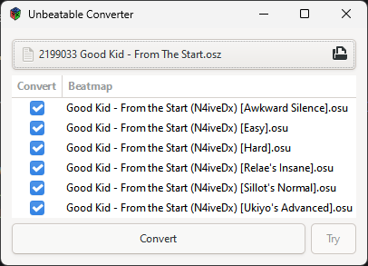

# Osu to Unbeatable Converter

Convert your Osu! beatmaps into Unbeatable maps!

## Features

- Use a friendly GUI to convert your Osu! maps. (Downloaded from https://osu.ppy.sh/beatmapsets)
- Alternatively, do it quickly via command line.
- Converts Osu! `.osz` files into an Unbeatable map.
- Supports all Osu! game modes (Standard, Taiko, Catch, Mania)
- Adds decorations (like flips) according to the original map

## Installation

> [!NOTE]
> Make sure you have the [.NET 10 Runtime](https://dotnet.microsoft.com/en-us/download/dotnet/10.0) installed.


Depending on your needs, you can install an interactive GUI version or a command-line version.

They are either marked with "GUI" or "CLI" in the release name.

1. Download the latest release from the [Releases](https://github.com/ErikGXDev/OsuUnbeatableConverter/releases)
   page.
2. Extract the downloaded ZIP file to a folder of your choice.
3. Run the executable (assuming Windows):
    - For GUI: `UnbeatableConverter.GUI.exe`
    - For CLI: `UnbeatableConverter.CLI.exe`

## GUI Usage



1. Find and download Osu! beatmaps from https://osu.ppy.sh/beatmapsets.
2. Open the GUI application.
3. Press the file button to select an Osu! `.osz` file.
4. If needed, select what beatmaps to convert.
5. Click "Convert" to start the conversion.
6. Alternatively, install the [Unbeatable Websocket Mod](https://github.com/ErikGXDev/UnbeatableWebsocket) and press "
   Try" to directly play the converted map in Unbeatable.

## CLI Usage

```powershell
UnbeatableConverter.CLI.exe "path\to\beatmap.osz"
```

This will convert the specified Osu! beatmap and save the output in the same directory.
